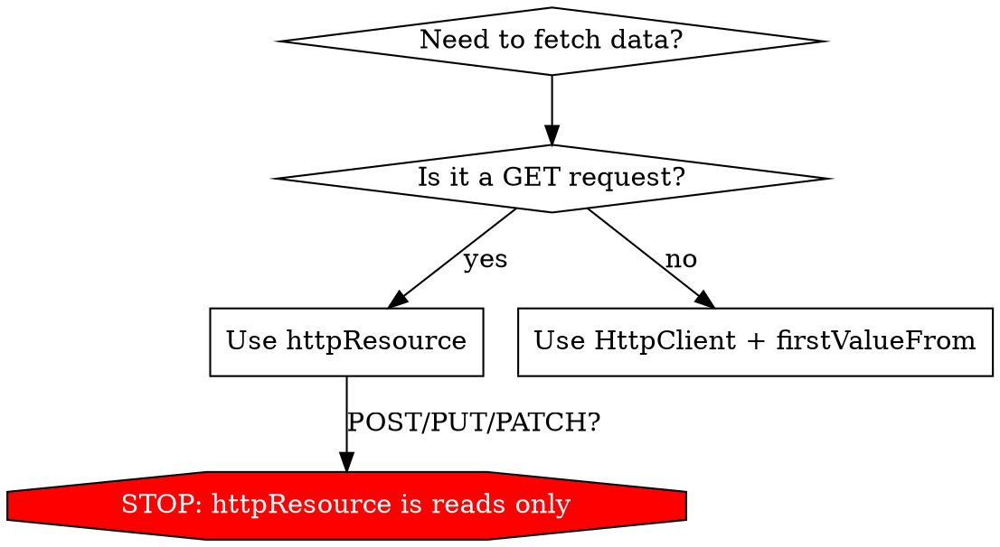

## Prerequisites

`app.config.ts` must include:

```typescript
provideHttpClient(withFetch())
```

## Two-tier strategy



| Operation | API | Why |
|-----------|-----|-----|
| **Read** (GET) | `httpResource` | Reactive signals, automatic loading/error state, cancellable |
| **Write** (POST, PUT, PATCH, DELETE) | `HttpClient` | One-shot, no need for persistent reactive state |

---

## Reading data with `httpResource`

### Basic usage

```typescript
import { httpResource } from '@angular/common/http';

export class RecipeListViewModel {
  private readonly recipesResource = httpResource<Recipe[]>(() => '/api/recipes');

  readonly recipes = computed(() => this.recipesResource.value() ?? []);
  readonly loading = this.recipesResource.isLoading;
  readonly error = computed(() => this.recipesResource.error() as string | null);
}
```

### Reactive parameters

`httpResource` accepts a factory function — any signal read inside it becomes a dependency. Use `toSignal` with `ActivatedRoute.paramMap` to derive signals from route params:

```typescript
import { toSignal } from '@angular/core/rxjs-interop';
import { ActivatedRoute } from '@angular/router';
import { map } from 'rxjs/operators';

export class RecipeDetailViewModel {
  private readonly route = inject(ActivatedRoute);

  private readonly id = toSignal(this.route.paramMap.pipe(map(p => p.get('id')!)));
  private readonly recipeResource = httpResource<Recipe>(() => `/api/recipes/${this.id()}`);

  readonly recipe = computed(() => this.recipeResource.value() ?? null);
  readonly loading = this.recipeResource.isLoading;
  readonly error = computed(() => this.recipeResource.error() as string | null);
}
```

When the route param changes, `httpResource` automatically cancels the pending request and fires a new one. No `setId()` needed — the view-model reads its own params.

### Advanced request options

```typescript
const resource = httpResource(() => ({
  url: `/api/recipes/${this.id()}`,
  method: 'GET',
  headers: { 'X-Request-Id': 'abc' },
  params: { include: 'ingredients' },
}));
```

### Response types

```typescript
httpResource.text(() => '/api/health');       // string
httpResource.blob(() => '/api/export');        // Blob
httpResource.arrayBuffer(() => '/api/binary'); // ArrayBuffer
```

### Response validation with Zod

```typescript
const recipeSchema = z.object({
  id: z.string(),
  name: z.string(),
  servings: z.number(),
});

const resource = httpResource(() => `/api/recipes/${id()}`, {
  parse: recipeSchema.parse,
});
```

---

## Writing data with `HttpClient`

Inject `HttpClient` directly in services. One-shot mutations don't need the reactive overhead of `httpResource`.

```typescript
import { HttpClient } from '@angular/common/http';
import { firstValueFrom } from 'rxjs';

@Injectable({ providedIn: 'root' })
export class RecipeService {
  private readonly http = inject(HttpClient);
  private readonly baseUrl = '/api/recipes';

  async create(data: CreateRecipeRequest): Promise<Recipe> {
    return firstValueFrom(this.http.post<Recipe>(this.baseUrl, data));
  }

  async update(id: string, data: UpdateRecipeRequest): Promise<Recipe> {
    return firstValueFrom(this.http.put<Recipe>(`${this.baseUrl}/${id}`, data));
  }

  async patch(id: string, data: Partial<UpdateRecipeRequest>): Promise<Recipe> {
    return firstValueFrom(this.http.patch<Recipe>(`${this.baseUrl}/${id}`, data));
  }

  async delete(id: string): Promise<void> {
    return firstValueFrom(this.http.delete<void>(`${this.baseUrl}/${id}`));
  }
}
```

- Always wrap with `firstValueFrom()` — the only acceptable RxJS usage.
- Services return `Promise<T>`, never raw `Observable`.
- For write operations with UI state, manage loading/error in the view-model (see below).

---

## State management

### `httpResource` state (reads)

`httpResource` exposes signals directly:

| Signal | Type | Description |
|--------|------|-------------|
| `value()` | `T` | The response data. **Throws** if in error state — guard with `hasValue()`. |
| `hasValue()` | `boolean` | Whether data was successfully loaded. |
| `isLoading()` | `boolean` | Whether a request is in-flight. |
| `error()` | `unknown` | The error object if the request failed. |

Map these in the view-model:

```typescript
readonly items = computed(() => this.itemsResource.value() ?? []);
readonly loading = this.itemsResource.isLoading;
readonly error = computed(() => this.hasError() ? this.formatError(this.itemsResource.error()) : null);
private readonly hasError = computed(() => this.itemsResource.error() != null);

private formatError(err: unknown): string {
  if (err instanceof HttpErrorResponse) return err.message;
  return 'Failed to load data';
}
```

### Write operation state (manual)

For mutations triggered by user actions, manage state in the view-model:

```typescript
private readonly submitting = signal(false);
private readonly submitError = signal<string | null>(null);

readonly submitting = this.submitting.asReadonly();
readonly submitError = this.submitError.asReadonly();

async save(data: CreateRecipeRequest): Promise<void> {
  this.submitting.set(true);
  this.submitError.set(null);
  try {
    const recipe = await this.recipeService.create(data);
    // update local state, navigate, etc.
  } catch (e) {
    this.submitError.set(e instanceof Error ? e.message : 'Failed to save');
  } finally {
    this.submitting.set(false);
  }
}
```

---

## Template rendering

### Read state — always handle all three states

```html
@if (vm.loading()) {
  <div class="space-y-4">
    <z-skeleton class="h-8 w-3/4" />
    <z-skeleton class="h-4 w-full" />
    <z-skeleton class="h-4 w-5/6" />
  </div>
} @else if (vm.error()) {
  <z-alert zType="destructive">{{ vm.error() }}</z-alert>
} @else {
  @for (item of vm.items(); track item.id) {
    <!-- render item -->
  }
}
```

### Write state — inline feedback

```html
@if (vm.submitting()) {
  <button z-button zLoading disabled>Saving...</button>
} @else {
  <button z-button (click)="vm.save(formData())">Save</button>
}
@if (vm.submitError()) {
  <z-alert zType="destructive" class="mt-2">{{ vm.submitError() }}</z-alert>
}
```

### Skeleton guidelines

- Match the shape of the content being loaded.
- Use multiple `<z-skeleton>` elements for lists: one per expected item.
- Use `class` to set width/height: `h-8 w-full`, `h-4 w-3/4`, `h-48 w-full` (for images).
- For cards: skeleton with header shape + body lines + optional image placeholder.

---

## View-model integration

Combine reads and writes in a single view-model, driven by route params:

```typescript
import { toSignal } from '@angular/core/rxjs-interop';
import { ActivatedRoute } from '@angular/router';
import { map } from 'rxjs/operators';

@Injectable()
export class RecipeDetailViewModel {
  private readonly route = inject(ActivatedRoute);
  private readonly recipeService = inject(RecipeService);

  // --- Read ---
  private readonly id = toSignal(this.route.paramMap.pipe(map(p => p.get('id')!)));
  private readonly recipeResource = httpResource<Recipe>(() => `/api/recipes/${this.id()}`);

  readonly recipe = computed(() => this.recipeResource.value() ?? null);
  readonly loading = this.recipeResource.isLoading;
  readonly error = computed(() => this.recipeResource.error() as string | null);

  // --- Write ---
  private readonly deleting = signal(false);
  private readonly deleteError = signal<string | null>(null);

  readonly deleting = this.deleting.asReadonly();
  readonly deleteError = this.deleteError.asReadonly();

  async delete(): Promise<void> {
    if (!this.recipe()) return;
    this.deleting.set(true);
    this.deleteError.set(null);
    try {
      await this.recipeService.delete(this.recipe()!.id);
      this.router.navigate(['/recipes']);
    } catch (e) {
      this.deleteError.set(e instanceof Error ? e.message : 'Failed to delete');
    } finally {
      this.deleting.set(false);
    }
  }
}
```

---

## Rules

- **`httpResource` for reads only.** Never use it for POST, PUT, PATCH, or DELETE.
- **`HttpClient` for writes only.** Don't use `firstValueFrom(http.get(...))` for reads — use `httpResource`.
- **Always expose `loading` and `error`.** Templates must render all states.
- **Skeletons for loading.** Never show a blank screen while loading. Match content shape.
- **`z-alert zType="destructive"` for errors.** Never raw text or `console.error` in templates.
- **Cancel-safe reads.** `httpResource` cancels pending requests automatically on parameter change.
- **No `Observable` in public API.** `firstValueFrom` is the only RxJS bridge — used in services only.
- **Type responses.** Always provide the generic type parameter: `httpResource<Recipe[]>`, `http.post<Recipe>`.
- **Guard `value()` reads.** Use `hasValue()` or provide a default: `resource.value() ?? []`.
