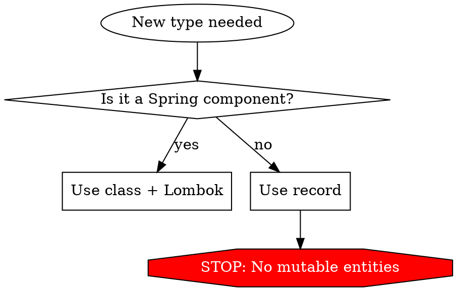

## Core style rules



### Records everywhere
- Use `record` for **all** data types: DTOs, entities, request/response objects, value objects, internal carriers.
- Entities are records too — we use JOOQ, not JPA, so no mutable-entity constraint.
- Records are immutable by default — lean into that.
- Use compact constructors for validation.
- Only exception: Spring-managed components (`@Service`, `@Component`, etc.) stay classes.

### Prefer nested records over many fields
- If a record has more than ~4–5 fields, group related ones into a nested record.
- Avoid builders entirely — a well-structured record with nested value objects is clearer.

```java
// Avoid
record Order(String street, String city, String zip, String country, BigDecimal total, Currency currency) {}

// Good
record Order(Address address, Money total) {}
record Address(String street, String city, String zip, String country) {}
record Money(BigDecimal amount, Currency currency) {}
```

### Value objects over primitives
- Wrap raw strings, ints, etc. in named records when they carry domain meaning.
- `RecipeId`, `UserId`, `EmailAddress`, `TagName` — not `String`, `int`, `String`, `String`.
- This prevents parameter mix-ups and makes intent obvious.

### Lombok for Spring components
- All Spring-managed classes (`@Service`, `@Component`, `@Repository`, `@Controller`, `@RestController`, `@Configuration`) use Lombok:
  - Injected dependencies: `private final` fields + `@RequiredArgsConstructor`.
  - No constructor boilerplate — let Lombok generate it.
- No `@Builder` — prefer records with nested types.

### No comments
- Do not add comments. If the code needs a comment, refactor it to be self-documenting: extract methods, use better names, introduce value objects.
- The code IS the documentation.

### `var` by default
- Use `var` for local variables unless the type is not obvious from the right-hand side.
- Readable: `var orders = repository.findByUser(userId);`
- Unreadable: `var x = transform(y);` — write the type explicitly here.
- Never use `var` for fields, parameters, or return types.

### Nullability with jspecify
- Every package has `package-info.java` with `@NullMarked`.
- Use `@Nullable` from `org.jspecify.annotations` on fields, parameters, and return types that can be null.
- Default is non-null — `@NullMarked` makes it so, `@Nullable` is the opt-out.
- Do not use `Optional` for fields or parameters — use `@Nullable` instead. `Optional` is for return types.

```java
// package-info.java
@NullMarked
package recipebase.server.recipes;

import org.jspecify.annotations.NullMarked;
```

### Method parameters — 3 max
- Keep methods to ~3 parameters max. Semantic ordering: subject first, then modifiers/config, then context.
- If you need more, group into a value object (record).

```java
// Avoid
var recipes = service.findRecipes(userId, query, sort, page, filters);

// Good
var recipes = service.findRecipes(userId, new RecipeQuery(query, sort, page, filters));
```

### Functional & immutable
- Prefer `Stream` pipelines over mutable accumulators and for-loops for data transformations.
- Use `List.of(...)`, `Map.of(...)`, `Set.of(...)` for constant/fixed collections.
- Avoid mutating collections in-place; collect into new ones.
- Use `Optional` as a return type instead of null-returning methods.
- Chain operations; avoid intermediate variables when the pipeline is clear.

```java
// Good
var activeNames = users.stream()
    .filter(User::isActive)
    .map(User::name)
    .toList();

// Avoid
var activeNames = new ArrayList<String>();
for (var user : users) {
    if (user.isActive()) {
        activeNames.add(user.name());
    }
}
```

### DDD-lite
- Think in aggregates and bounded contexts, but don't over-engineer.
- Each aggregate root owns a clear consistency boundary — group related entities under it.
- Value objects are records. Entities are records (JOOQ).
- Repositories return domain types, not raw DB rows.
- Keep domain logic in the domain layer; thin services/controllers delegate.
- Anti-corruption layers at boundaries between modules or external APIs.

## Project specifics

- Package: `recipebase.server`
- Java 25 toolchain — use modern features (switch expressions, pattern matching, sealed types).
- Build: `./gradlew build`
- Test: `./gradlew test`

## Common rationalizations

| Excuse | Reality                                                                   |
|--------|---------------------------------------------------------------------------|
| "This one needs a comment for clarity" | Refactor to self-documenting code. Extract method, use better name.       |
| "A builder would be cleaner here" | Nested records are clearer. A builder means too many flat fields.         |
| "The type is obvious, no need for var" | Use `var` unless the RHS type is genuinely ambiguous.                     |
| "Optional is fine for this parameter" | Use `@Nullable` for params/fields. Optional is for return types only.     |
| "Just one more parameter is fine" | Group into a record if it makes sense. 3 params max is the preferred way. |
